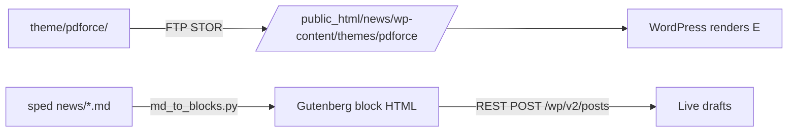

# Repository Guidelines

## Project Overview

Source of truth and deployment tooling for the **Parent Data Force news site**, a WordPress install live at `https://www.parentdataforce.com/news/`. The repo holds one custom block theme (`pdforce`), Python tooling that syncs it to a cPanel host over FTP, and a REST-based content pipeline that publishes long-form special-education policy analysis.

The news site is a sub-install of the main org site at `parentdataforce.com`; the theme's header nav links out to the main site's sections (`/data/`, `/districts/`, `/cases/`, `/articles/`, `/appearances/`, `/resources/`, `/about/`, `/submit/`, `/donate/`) — see `theme/pdforce/patterns/header.php`.

> **This repo deploys directly to production.** There is no staging environment. Scripts marked ⚠️ below mutate the live site over FTP/REST.

## Memory (Mnemopi)

Mnemopi is this project's memory backend (`~/.omp/agent/config.yml` → `memory.backend: mnemopi`;
`per-project-tagged` scope, polyphonic + enhanced recall). Re-deriving a fact that is already stored is
a defect — treat memory as the **first place to look and the last step before you yield**.

- **`recall` before asking or searching.** Anything about prior decisions, conventions, or "how does X
  work here" starts with `recall` — not a repo sweep, and never a question to the user that a previous
  session already answered. `read memory://root` is the cross-project bank: machine-wide constraints
  (Docker/WSL2 unusable, PHP/Composer paths, LM Studio serving rules) live there, not here.
- **`reflect` to synthesise.** When the answer spans many memories ("why is it built this way", "what
  did we decide about X", "what's the history here"), use `reflect`, not `recall`.
- **`retain` the moment a fact turns durable** — not as a wrap-up step. For this repo that means:
  live-site state that the repo does not record (published post ids/status, `permalink_structure` and
  rewrite-rule repairs, theme slug ↔ pattern `Slug:` header contracts), the specific failure modes in
  "Known failure modes" below as they are re-encountered, and REST/FTP quirks plus their workarounds.
  Each entry self-contained (who/what/when/why + the evidence).
- **Never retain credentials.** `rest/credentials.json` is the single secret source and is explicitly
  *not* to be persisted — no host, user, or key in memory, ever.
- **Dedupe before writing.** `recall` the topic first; if an entry exists, `memory_edit` it (`update`),
  or **prefer `invalidate` over `forget`** — it preserves history.
- **Never store** ephemeral task state, or anything the code already says plainly. The value is what
  the code *can't* tell you.
- **Repeatable procedure → `learn`/`manage_skill`** so it surfaces next session; bare facts → `retain`.
- **Offload memory/embedding/git chores** to the `memory-worker` subagent via `task` (runs on the fast
  local model) instead of spending default-model turns on them.

## Architecture & Data Flow

Two independent planes, joined by the theme folder:



**Content plane:** Markdown article (outside repo) → `tools/md_to_blocks.py` → Gutenberg block HTML → `tools/publish_articles.py` → REST `POST /wp/v2/posts` with `status:draft` and `template:single-long-form`.

**Deploy plane:** `theme/pdforce/` → `tools/deploy_theme.py` → recursive FTP upload (resume-by-size) → theme switch + permalink flush via a one-shot PHP helper.

### FSE resolution chain

WordPress Full Site Editing resolves a request through three hops. Each hop is a real file:

1. `theme/pdforce/templates/single-long-form.html` — the template, chosen by the post's `template` field
2. `<!-- wp:template-part {"slug":"header"} /-->` → `theme/pdforce/parts/header.html`
3. `<!-- wp:pattern {"slug":"pdforce/header"} /-->` → `theme/pdforce/patterns/header.php`

**Invariant:** the `Slug:` header in every `patterns/*.php` must match the `pdforce/<slug>` string referenced from `templates/*.html` and `parts/*.html`, and `<slug>` must match the filename minus `.php`. A rename that breaks this silently drops blocks from rendered output. All 102 patterns currently conform.

## Key Directories

| Path | Purpose |
|---|---|
| `theme/pdforce/` | The live block theme. Deployed wholesale. |
| `theme/pdforce/templates/` | 9 FSE templates. `single-long-form.html` is the custom one for articles. |
| `theme/pdforce/parts/` | 7 template parts (`header`, `footer`, `sidebar`, …). |
| `theme/pdforce/patterns/` | 102 PHP block patterns. Filename ↔ `Slug:` ↔ template reference. |
| `theme/pdforce/styles/` | Five global style variations (`0*.json`) + `blocks/` partial styles + `sections/`. |
| `tools/` | Current Python tooling. **Stdlib only.** |
| `rest/` | REST CLI, credentials, one-shot PHP helpers, `.htaccess` rules. |
| `docs/migration/` | **Legacy.** Historical migration scripts and plans. See caveats below. |
| `captures/` | **Historical snapshots, do not edit.** Pre-rename era; still reference `twentytwentyfive` and `/wordpress/` URLs. |

## Development Commands

All `tools/*.py` scripts load `../rest/credentials.json` relative to the current directory, so **run them from `tools/`** — except `deploy_theme.py`, which calls `os.chdir(HERE)` and can be invoked from anywhere.

### Safe (read-only)

```bash
cd tools
python wp_api.py                    # (library; no main) — import it
python ../rest/wp.py whoami         # confirm REST auth works
python ../rest/wp.py posts --limit 10
python ../rest/wp.py terms --taxonomy categories
python md_to_blocks.py "C:/Users/paren/Development/sped news/article1_dese_memo.md" --title
python deploy_theme.py --verify     # GETs live pages + REST; writes nothing
python ../docs/migration/verify_changes.py   # needs `requests` (legacy)
```

### ⚠️ Mutates production

```bash
cd tools
python deploy_theme.py --all         # uploads every theme file (use after any theme edit)
python deploy_theme.py                # size-skip upload: a same-byte-length edit ships NOTHING
python deploy_theme.py --dry-run      # list what would be uploaded
python deploy_theme.py --fix          # runs the one-shot PHP helper only
python prune_theme_styles.py          # lists theme style files live but absent from the repo
python prune_theme_styles.py --delete # DELETES them over FTP
python build_contribute_page.py       # upserts /contribute/ (content is the pdforce/contribute pattern)
python build_settlements_page.py --snapshot ...  # upserts the settlement tracker page
python publish_articles.py             # creates 3 draft posts
python fetch_theme.py                  # pulls live theme INTO theme/pdforce/ (overwrites local!)
```

`deploy_theme.py` only ever uploads — it never removes. Deleting a theme file locally does **not** delete it live; run `prune_theme_styles.py --delete` for style variations. That host's FTP also refuses `MLSD` on subpaths (`550 Can't check for file existence`), so prune recurses on `NLST` and uses `SIZE` to tell files from directories.

`fetch_theme.py` is the dangerous one in the reverse direction: it overwrites local theme files with whatever is live. Commit before running it.

### CSS build (only when editing `style.css`)

```bash
cd theme/pdforce
npm install          # first time; node_modules/ is not present by default
npm run build        # postcss + cssnano: style.css -> style.min.css
```

Required because `functions.php` enqueues `style.min.css` when `SCRIPT_DEBUG` is off (production) and `style.css` when on. Editing only `style.css` leaves production unchanged. Documented in `theme/pdforce/contributing.txt`.

## Code Conventions & Common Patterns

### Stdlib-only rule (tools/ and rest/)

Every import in `tools/*.py` and `rest/wp.py` is stdlib: `ftplib`, `urllib.request`, `json`, `os`, `re`, `sys`, `secrets`, `io`, `base64`, `argparse`, `importlib`. **Do not add third-party dependencies to these.** No `requests`, no `pip install`.

The exception is legacy `docs/migration/*.py`, which does import `requests` and `bs4` (per `docs/migration/requirements.txt`). Those scripts are not part of the current workflow — do not extend them.

### Centralized credentials

`rest/credentials.json` (gitignored, untracked — confirmed via `git ls-files`) is the single secret source:

```jsonc
{
  "username": "pdforce",          // REST + wp-login: the WP LOGIN name (user id 1)
  "application_password": "...",  // REST: HTTP Basic password
  "login_password": "...",        // STALE — wp-login.php rejects it
  "rest_url": "https://www.parentdataforce.com/news/wp-json/",
  "ftp": { "host": "...", "user": "...", "password": "..." }
}
```

Load idiom used by every script:

```python
with open("../rest/credentials.json", encoding="utf-8") as f:
    creds = json.load(f)
```

`login_password` does **not** work for cookie auth, so wp-admin previews of drafts are unavailable. REST with `application_password` works. Never commit secrets; never print values.

**Login name is `pdforce`, not `admin`.** `GET /wp/v2/users` returns `name: "admin"` but `slug: "pdforce"` — "admin" is only the display name and is not a registered login (a `wp-login.php` probe returns *"The username admin is not registered on this site"*). Use `pdforce` for both REST Basic auth and any cookie login. `docs/migration/wordpress_setup_guide.md` documents that the username was deliberately changed away from `admin`.

### Auth reuse, not duplication

`tools/wp_api.py` reuses `rest/wp.py`'s `WP` class rather than reimplementing Basic auth:

```python
spec = importlib.util.spec_from_file_location("wp_rest", os.path.join(REST_DIR, "wp.py"))
```

It wraps it in a `Client` with a `quiet` flag (the base class always prints JSON). New REST tooling should import `wp_api.client()`.

`tools/publish_articles.py` imports its sibling via `sys.path.insert(0, os.path.dirname(os.path.abspath(__file__)))`, then `from md_to_blocks import convert, slugify`.

### FTP resume-by-size

Uploads/fetches skip files whose remote size already matches local, using `MLSD`:

```python
sizes = {n: int(a.get("size", -1)) for n, a in ftp.mlsd(path) if a.get("type") == "file"}
if sizes.get(name) == os.path.getsize(lp):
    skipped += 1; continue
```

Used by `deploy_theme.py` (upload) and `fetch_theme.py` (download). `deploy_theme.py` adds a 3-attempt retry with reconnect on `ftplib.error_temp`/`OSError`/`EOFError`.

### One-shot PHP helper pattern

Some WordPress state is **not writable via REST** — notably `permalink_structure`, which the settings schema does not expose. The workaround is a temporary PHP file that bootstraps WordPress, acts, and is deleted:

```php
require_once __DIR__ . '/wp-load.php';
header('Content-Type: application/json');
// guard, act, echo json_encode($out)
```

Two variants exist:
- `rest/_setpw.php` — guard is an **env var** (`getenv('WP_NEW_PW')`), 400 if absent.
- `rest/_fixpermalinks.php` — guard is a **substituted secret** (`__SECRET__` placeholder compared with `hash_equals`), 403 on mismatch.

`tools/deploy_theme.py` operationalizes the second: it replaces `__SECRET__` with `secrets.token_urlsafe(24)` at upload time, uploads to `/public_html/news/_fixpermalinks.php`, invokes it once over HTTPS with `?key=…&switch=pdforce`, deletes it via FTP, then **confirms it 404s**.

**Never leave a helper on the server.** If a run aborts mid-way, delete `/public_html/news/_fixpermalinks.php` manually.

### Theme naming

The theme slug is `pdforce` and must stay consistent across four surfaces: the folder name `theme/pdforce/`, `Text Domain: pdforce` in `style.css`, the PHP function prefix `pdforce_*` in `functions.php`, and every `Slug: pdforce/<name>` pattern header. Registered identifiers: pattern categories `pdforce_page` and `pdforce_post-format`; block binding source `pdforce/format`; style handle `pdforce-style`.

PHP functions use the child-theme guard idiom:

```php
if ( ! function_exists( 'pdforce_block_styles' ) ) :
    function pdforce_block_styles() { … }
endif;
add_action( 'init', 'pdforce_block_styles' );
```

### Block style className mapping

A `slug` in `theme/pdforce/styles/blocks/*.json` becomes the className `is-style-<slug>` in block markup:

| File | Slug | className | Applies to |
|---|---|---|---|
| `01-display.json` | `text-display` | `is-style-text-display` | `core/heading`, `core/paragraph` |
| `02-subtitle.json` | `text-subtitle` | `is-style-text-subtitle` | `core/heading`, `core/paragraph` |
| `03-annotation.json` | `text-annotation` | `is-style-text-annotation` | `core/heading`, `core/paragraph` |
| `post-terms-1.json` | `post-terms-1` | `is-style-post-terms-1` | `core/post-terms` |

`md_to_blocks.py` emits `is-style-text-subtitle` for the article dek. `templates/single.html` uses `is-style-post-terms-1`.

### Markdown converter contract

`tools/md_to_blocks.py` supports exactly the subset the articles use — nothing more. Do not add table/code/image/link support speculatively.

| Markdown | Gutenberg output |
|---|---|
| Line 1 `# Title` | Extracted as post title, **removed from body** |
| First fully-`*italic*` line | `core/paragraph` with `className: is-style-text-subtitle` |
| `## H2` / `### H3` | `core/heading` with `<h2>` / `<h3>` |
| Plain paragraph | `core/paragraph` |
| `---` alone | `core/separator` with `is-style-wide` |
| `- item` | `core/list` → `<ul>` with nested `core/list-item` |
| `1. item` | `core/list {"ordered":true}` → `<ol>` with `core/list-item` |
| `**bold**` / `*italic*` | `<strong>` / `<em>` |
| `` standalone line | `core/image` → `<figure class="wp-block-image"></figure>` |
| `` standalone line | Same, plus `<figcaption class="wp-element-caption">` after the ``; caption supports inline bold/italic |
| `==figure==` | `<span class="pdf-figure">` — inline data emphasis (money, dockets, counts). Runs last, after bold/italic, so `==**x**==` nests correctly |
| `!> text` standalone line | `core/paragraph {"className":"pdf-callout"}` — boxed aside; consecutive lines join, a blank line or a different marker flushes |
| `!\| text` standalone line | `core/paragraph {"className":"pdf-pullquote"}` — large pull-quote line; same continuation rule |

Public API: `convert(md_text) -> (title, dek, body)`, `slugify(title)`, `inline(text)`, `escape(text)`.

Escaping order matters and is deliberate: `escape()` converts `&`, `<`, `>` first, then `inline()` applies bold **before** italic so `**` never misfires as two `*`. Typographic quotes and em-dashes pass through as UTF-8.

Nested `core/list-item` comments are required — WP 6.3+ flags bare `<li>` as invalid blocks.

## Important Files

| Path | Role |
|---|---|
| `theme/pdforce/theme.json` | Brand + design tokens. `version: 3`, schema `wp/6.7`. |
| `theme/pdforce/functions.php` | 7 `pdforce_*` functions: post formats, editor style, stylesheet enqueue, block styles, pattern categories, block bindings. |
| `theme/pdforce/templates/single-long-form.html` | The article template. |
| `theme/pdforce/patterns/article-meta.php` | `Inserter: no` pattern rendering date · author · category. |
| `theme/pdforce/patterns/header.php` | Brand header: logo, site title, main-site nav. |
| `rest/wp.py` | REST CLI (see subcommands below). |
| `rest/credentials.json` | Secrets. Gitignored. |
| `tools/deploy_theme.py` | The only complete deploy path. |
| `tools/wp_api.py` | REST client for tooling. |
| `.gitignore` | Excludes secrets, `wordpress-copy/`, `theme/pdforce/twentytwentyfive/`. |

### `rest/wp.py` subcommands

Run from `rest/` (it resolves `credentials.json` next to itself). Prints JSON, exits non-zero on HTTP ≥ 400.

```bash
python wp.py whoami
python wp.py posts [--limit N] [--status S] [--page P]
python wp.py get-post --id N
python wp.py new-post --title T [--content HTML] [--status draft] [--slug S] [--categories IDS]
python wp.py update-post --id N [--title T] [--content HTML] [--status S] [--slug S]
python wp.py delete-post --id N [--force]
python wp.py pages [--limit N] [--page P]
python wp.py get-page --id N
python wp.py new-page --title T [--content HTML] [--status publish]
python wp.py delete-page --id N [--force]
python wp.py terms [--taxonomy categories|tags]
```

Note `new-post` defaults to `--status publish`. Pass `--status draft` explicitly. It has no `--template` flag — use `tools/publish_articles.py` or `wp_api` to assign `single-long-form`.

### `theme.json` design tokens

Palette (slug → hex), the "Ember" look baked as the site default: `base` `#101112`, `contrast` `#dcdfe3`, **`accent-1` `#ff5a1f`** (brand orange), `accent-2` `#ffa366`, `accent-3` `#17191b`, `accent-4` `#9aa0a6` (muted text), `accent-5` `#383c41`, `accent-6` `#202327`. Four more looks ship as style variations in `theme/pdforce/styles/`: Current (the pre-1.14 look, verbatim), Slate, Paper, Split. Selectable in Site Editor → Styles; Ember is the `theme.json` default so every visitor sees it.

Layout: `contentSize: 750px` (widened from upstream 645px for long-form reading), `wideSize: 1340px`. Body: Vollkorn (preset slug `body`), `fontSize: medium`, `lineHeight: 1.65`, `blockGap: 1.5rem`. Both families are **self-hosted** variable woff2 in `assets/fonts/` (Vollkorn normal+italic, Fira Code) and loaded through `settings.typography.fontFamilies` `fontFace` — no Google Fonts dependency. Other families (Beiruti, Fira Sans, Literata, Manrope, Platypi, Roboto Slab, Ysabeau) are still on disk but unreferenced.

**Style variations must live directly in `theme/pdforce/styles/*.json`** — WordPress only registers global variations from that directory's top level, not from subdirectories. `styles/blocks/` and `styles/sections/` are separate resolvers and must not be moved up.

`customTemplates`: `page-no-title` (pages) and **`single-long-form`** (posts) — the latter is what makes the REST `template` field accept that value.

## Runtime/Tooling Preferences

- **Python 3.14.7** locally. Code targets ~3.8+ (f-strings, no `match`, no PEP 604 unions). Interpreter is `python`, not `python3`.
- **Node 24.20.0 / npm 11.19.0** available; `theme/pdforce/package.json` requires node ≥ 20.10.0, npm ≥ 10.2.3. `node_modules/` is absent — npm is needed **only** for the `style.css` → `style.min.css` build.
- **Windows.** Use forward slashes in Python paths. The article source folder is `sped news` — it contains a space, so quote it.
- No package manager for Python; no venv; no lockfile for `tools/`.
- **Bash tooling constraint:** the shell here blocks `grep`, `rg`, `cat`, `head`, `tail`, `sed`, `find`. Use the built-in `grep`/`glob`/`read` tools, or `python -c` for text processing.

### Live server layout

| Item | Path |
|---|---|
| Document root | `/public_html/news/` |
| RewriteBase | `/news/` (see `rest/wp-haccess`) |
| Theme | `/public_html/news/wp-content/themes/pdforce/` |
| Brand logo | `/public_html/news/wp-content/uploads/brand/logo.png` |
| FTP host | `ftp.parentdataforce.com` (cPanel, PASV, `MLSD` supported) |

`rest/wp-haccess` is the reference copy of the live `.htaccess`. It routes everything through `/news/index.php` when the request is not an existing file or directory.

Current live state (verified): active theme `pdforce` ("Parent Data Force"), `permalink_structure` = `/%postname%/`.

## Testing & QA

**There is no test suite and no CI.** Confirmed absent: no `tests/`, no `test_*.py`, no `*_test.py`, no `conftest.py`, no `pytest.ini`, no `phpunit.xml`, no `jest.config`/`vitest.config`, no `.github/workflows/`, no eslint/stylelint/phpcs config, no `.pre-commit-config.yaml`, no `.editorconfig`.

Verification is **end-to-end against production**. Do not write unit tests for this repo; prove a change by observing live rendered output.

### Script safety classification

| Script | Checks | Mutates live? |
|---|---|---|
| `tools/deploy_theme.py --verify` | REST active theme + settings; GETs home, `/hello-world/`, `?p=1`, logo | No (verify mode) |
| `tools/publish_articles.py --verify` | GET-back content equality + `template` persistence | Yes (creates drafts) |
| `docs/migration/verify_changes.py` | GETs `https://www.parentdataforce.com/news/`, asserts theme enhancements present | No |
| `docs/migration/monitor_health.py` | Site health/performance (legacy; needs `requests`) | No |
| `docs/migration/backup_restore.py` | — | **Yes** — writes zips, has `restore_*` and `delete_old_backups` |

### Required smoke test after any theme change

```bash
cd tools
python deploy_theme.py --all       # ALWAYS --all; the default path skips same-size files
python deploy_theme.py --verify
```

Then assert on the rendered HTML of a public URL. Drafts are **not** publicly reachable, so use a throwaway post:

```python
# create -> GET public URL -> assert -> delete
import wp_api
c = wp_api.client()
p = c.call("POST", "/wp/v2/posts", {"title": "__render_check__", "content": BLOCKS,
           "status": "publish", "slug": "__render_check__",
           "template": "single-long-form"}, quiet=True)
# GET p["link"], then assert on the HTML:
#   'wp-theme-pdforce'          -> correct theme active
#   'wp-block-post-title'       -> template rendered the title
#   'wp-block-post-date'        -> article-meta pattern ran
#   'wp-block-post-author-name' -> article-meta author block
#   'wp-block-separator'        -> meta separator
#   'is-style-text-subtitle'    -> dek block style applied
#   '<h2' / '<h3'               -> headings
#   '<strong>' / '<em>'         -> inline emphasis
#   'wp-block-list'             -> lists
#   'More posts' / 'Post navigation' -> trailing patterns
c.call("DELETE", f"/wp/v2/posts/{p['id']}?force=true", quiet=True)
```

Always delete the throwaway post. Never publish it under a real slug.

### Known failure modes to assert against

1. **Stale rewrite rules.** Symptom: links render as the literal `%postname%` or malformed `%post_name%`, and `?p=N` returns the blog home instead of the post. Cause: `permalink_structure` unset/corrupt, or `rewrite_rules` not flushed after a URL move. Fix: `rest/_fixpermalinks.php` via `deploy_theme.py --fix`.
2. **Theme slug mismatch.** Symptom: blocks silently missing from rendered pages, no error. Cause: a `Slug:` header in `patterns/*.php` diverging from the `pdforce/<slug>` reference in `templates/`/`parts/`. Check after any rename.
3. **`style.min.css` drift.** Symptom: CSS edits have no effect in production. Cause: `style.css` edited without `npm run build`; production enqueues the min file when `SCRIPT_DEBUG` is off.
4. **`fetch_theme.py` clobbering local work.** It overwrites `theme/pdforce/` from live. Commit first.
5. **WP block-gap margin inside a custom grid.** Symptom: cards in a CSS grid sit 24px lower than their row-mates. Cause: WordPress's flow layout applies `margin-top` to every non-first child, which lands on the grid's children and fights a `gap: 1px`. Fix: `.mygrid > * { margin-top: 0 }`.
6. **Source order beating a media query.** Symptom: a `@media (max-width: 900px)` collapse "does nothing". Cause: the base rule is declared *after* the media block; equal specificity, so the later rule wins. Fix: put the media block after every rule it must override.
7. **`color-mix()` declared on `:root` does not re-resolve on a subtree.** Custom properties substitute at computed-value time on the element that declares them, so overriding `--pdf-ink-0` on `main` leaves a `:root`-declared `--pdf-body` pointing at the old inputs. To re-point a whole subtree, redeclare the derived tokens too, with literal values.
8. **Variations are per-user data.** Selecting a style variation changes only the logged-in admin's view. Whatever look you want everyone to get must be baked into `theme.json`'s palette and `styles.color`.
9. **Site Editor variation pills have no text.** Entries for palette-only variations render as unlabeled previews; their names live in `aria-label` on `.global-styles-ui-variations_item`. Do not conclude a variation is missing because no label is visible.

## Caveats: stale and legacy content

Do not trust these without checking:

- `PARENT_DATA_FORCE_WORDPRESS_PROJECT_SUMMARY.md` — a historical snapshot, now annotated with `[corrected]` markers where its claims were disproved against the live site. It originally claimed a `theme/custom-parentdataforce/` theme exists (it does not) and that custom post types `cases`/`districts`/`resources`/`appearances` are registered (`GET /wp/v2/types` returns core types only). Read the annotations, not the original text.
- `README.md` — now the authoritative short orientation and points here. It previously named `tools/upload_theme.py` as the deploy path; `tools/deploy_theme.py` supersedes it (recursive upload + theme switch + permalink fix vs. a fixed 5-file list).
- `tools/theme_patch.py` — **archived** to `../_archive/`. It read a bare `theme.json` from cwd (which no longer exists), and its branding output is already committed in `theme/pdforce/theme.json`. Verified: of 278 leaf values, 276 match exactly; the only deltas were `styles.typography.lineHeight` 1.6 → **1.5** (a regression) and dropping `core/code` `lineHeight`. Do not restore it.
- `docs/migration/wp_config.py` — **legacy/superseded** (nothing current imports it; tooling uses `rest/credentials.json`). Still points at `http://localhost/wp-json/wp/v2`, has a placeholder password, and declares `CUSTOM_POST_TYPES` (`cases`, `districts`, `resources`, `appearances`) that do not exist on the live site. Its `WP_USERNAME` was `"admin"` (wrong — the login is `pdforce`); now corrected in-file with a note.
- `docs/migration/parentdataforce-wordpress.agent` — references `tools/wp.py`, `tools/migrate_parentdataforce.py`, `tools/wp_config.py`; none exist at those paths.
- `docs/migration/` generally — historical migration artifacts. `eagle3_spec_config.json`, `EAGLE3_SETUP.md`, `run_eagle3.py`, `autoresearch.py`, `sc_probe.py`, `sc_tool_test.py` are unrelated to WordPress (leftovers from other work; verified — none reference `wp-json`, `wp-content`, or the theme).
- `captures/` — frozen HTML/CSS/PNG snapshots from the pre-`/news`, pre-rename era. They still contain `twentytwentyfive` and `/wordpress/` URLs. Reference only; never edit or treat as current.
- `theme/pdforce/package.json` — still carries upstream metadata (`"description": "Default WP Theme"`, `"author": "The WordPress Contributors"`, `homepage` pointing at wordpress.org). Cosmetic, but a rename leftover.

### Article sources live outside the repo

`tools/publish_articles.py` hardcodes absolute paths to `C:/Users/paren/Development/sped news/` (note the space). The three articles are Massachusetts special-education policy analyses: the DESE significant-disproportionality methodology memo (SY2026-2027-2), a Student Opportunity Act funding-consequences analysis, and the *Hellman v. Craven* Supreme Court case. They are published as **drafts** (ids 15, 16, 17) with `template: single-long-form`; they are not publicly visible until flipped to `publish` in wp-admin.

This is a portability caveat: the pipeline breaks if that folder moves.

## Git

Remote: `https://github.com/p-d-force/parentdataforce-wordpress.git`, branch `main`.

Pushing from this shell fails: `SSH_ASKPASS=false` is exported and the Windows credential store (`wincredman`) is empty and unwritable headless, so git cannot authenticate or prompt. Push from a normal terminal instead.

Commit convention observed: imperative subject line, then grouped bullet sections (`Theme rename:`, `Tooling:`, `Cleanup:`). Rename-heavy commits should show as `R` (rename) entries in `git status`, not delete+add — use `git mv`.
